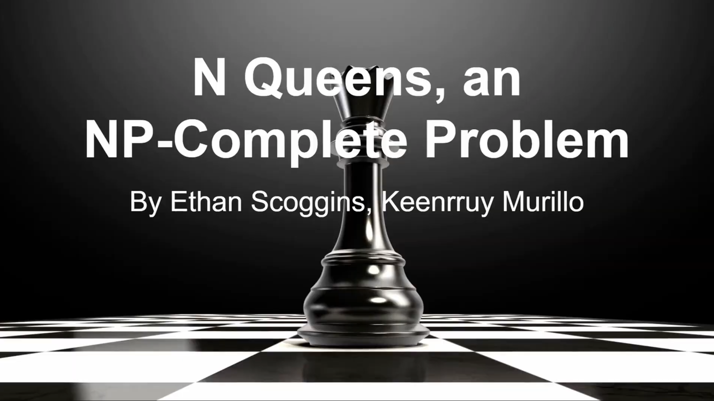

# N-Queens-Genetic-Algorithm-Wisdom-of-Artificial-Crowds
A group research project meant to implement Genetic Algorithms in collaboration with the WIsdom of Artifical Crowds to search for optimal configurations of the N-queens problem: https://en.wikipedia.org/wiki/Eight_queens_puzzle

)
